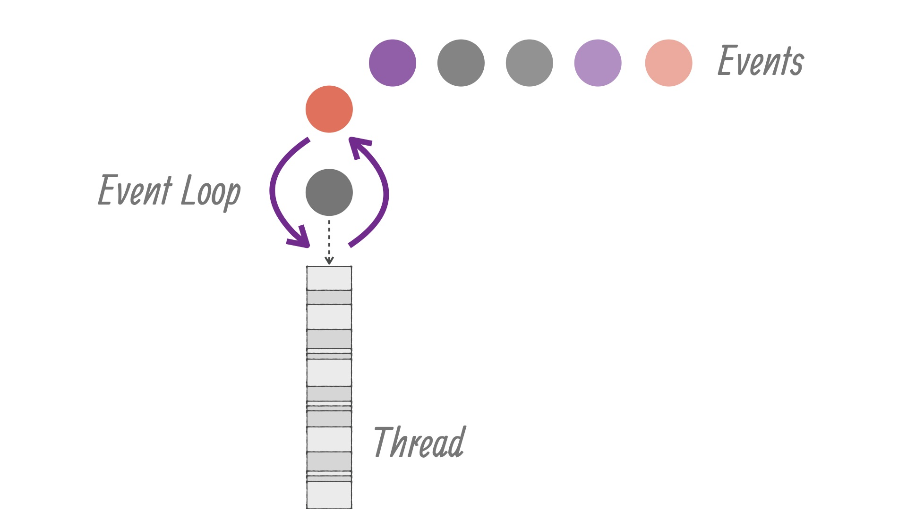

# 3.2 Hello, Vert.x 与异步无阻塞 API

&emsp;&emsp;讲完了茴香豆的茴字的几种写法，我们来正式跟 *Vert.x* 打个招呼。下面是参考官网主页上的例子写的一段样例代码：
```java
import io.vertx.core.AbstractVerticle;
import io.vertx.core.http.HttpHeaders;

public class MyHttpServerVerticle extends AbstractVerticle {
	
    private static final String[] ARRAY = new String[] {
        "May the Force be with you.",
        "Why so serious?",
        "Farewell, My Concubine."
    };

    private int index;
	
    @Override
    public void start() {
		
        index = 0;
		
        vertx.createHttpServer().requestHandler(req -> {
            req.response()
                .putHeader(HttpHeaders.CONTENT_TYPE, "text/plain")
                .end(ARRAY[index]);
        }).listen(8080, ar -> {
            if (ar.succeeded()) {
                System.out.println("HTTP server started.");
            } else {
                System.out.println("HTTP server error: " + ar.cause().getMessage());
            }
        });

        vertx.setPeriodic(1000, this::rotate);

        System.out.println("MyHttpServerVerticle started.");
    }

    public void rotate(long timerId) {
        index = index + 1;
        index = index % ARRAY.length;
        System.out.println("Current index: " + index);
    }
}
```

> 注：*pom.xml* 文件中要添加依赖：
> ```xml
> <dependency>
>     <groupId>io.vertx</groupId>
>     <artifactId>vertx-core</artifactId>
>     <version>3.5.0</version>
> </dependency>
> ```

&emsp;&emsp;这个例子首先创建了一个 *HTTP服务器*，为它设置了 *HTTP请求* 的 *处理函数*（Handler），对于每个 *请求* 都直接返回一段文本；然后监听 *8080* 端口，为监听结果设置 *处理函数*，监听成功则打印 “*HTTP服务器* 启动成功”，监听失败则打印相应的异常信息；另外还设置了一个每1000毫秒触发一次的 *定时器* ，每次触发将文本的索引切换一下，并打印新的索引，这里利用了之前提到的 *η转换*；在做完这一切之后，打印 “`MyHttpServerVerticle` 已启动”。

> 注：这个例子里的三个 *处理函数* 都是以 *Lambda表达式* 的方式给出的，它们的类型分别是 `Handler<HttpServerRequest>`、`Handler<AsyncResult<HttpServer>>` 和 `Handler<Long>` 。

&emsp;&emsp;*Vert.x* 中的基本模块叫做 *Verticle*，最常见的用法是定义一个类继承 `AbstractVerticle`，然后重载它的 `start` 方法，有些时候还需要重载 `stop` 方法。在一个 *Verticle* 实例被 *部署*（*deploy*）时，它的 `start` 方法被调用一次，在它被 *反部署*（*undeploy*，或者叫 *撤销*）时，它的 `stop` 方法被调用一次。

&emsp;&emsp;好的，现在我们 *Verticle* 已经写好了，应该怎么部署呢？首先，我们需要实例化一个 `Vertx` 对象，像这样：
```java
Vertx vertx = Vertx.vertx();
```
&emsp;&emsp;通常一个程序只需要实例化一个 `Vertx` 对象。然后，像这样部署一个 *Verticle*：
```java
vertx.deployVerticle(MyHttpServerVerticle.class.getName(), ar -> {
    if (ar.succeeded()) {
        System.out.println(ar.result());
    } else {
        System.err.println(ar.cause().getMessage());
    }
});
```
&emsp;&emsp;如果有需要，你还可以用这个 `Vertx` 实例继续部署更多的 *Verticle*。这里需要说明一下，这里 *处理函数*（或者说 *Lambda表达式*）的类型是 `Handler<AsyncResult<String>>`，所以参数类型是 `AsyncResult<String>`。到目前为止，我们已经两次看见以 `AsyncResult<T>` 为参数的 *处理函数* 了，它是干什么的呢？

&emsp;&emsp;一个 `AsyncResult<T>` 对象代表了一次异步操作的结果（以下简称 *异步结果*），下面是它的定义：

```java
public interface AsyncResult<T> {

    // 获取异步操作的结果（成功时）
    T result();

    // 获取异步操作的异常（失败时）
    Throwable cause();

    // 判断是否成功
    boolean succeeded();

    // 其他方法...
}
```
&emsp;&emsp;在异步操作完成时，它会作为参数被传递给我们编写的 *处理函数* 处理；如果异步操作成功，它会保存类型为 `T` 的结果，我们可以通过 `result` 方法获取这个结果；如果异步操作失败，它会保存导致失败的异常，我们可以通过 `cause` 方法获取这个异常。  
&emsp;&emsp;在上面部署 *Verticle* 的代码中，如果部署成功，部署生成的 `deploymentID`（一个UUID） 会被打印出来，如果部署失败，异常的描述信息会被打印出来。

&emsp;&emsp;如果端口没被占用，我们的网站应该就发布成功了，在浏览器里打开 `http://localhost:8080/` 即可看到返回的文本。

&emsp;&emsp;我们之前有提到Vert.x是事件驱动，异步无阻塞的，那么我们回顾一下这个 *HTTP服务器* 样例代码，看看具体体现在哪。

&emsp;&emsp;在上面的样例代码中，有三处通过 `System.out.println` 打印出与当前状态有关的信息；通常，运行这段程序，在控制台会按照以下顺序输出：

> MyHttpServerVerticle started.  
> HTTP server started.  
> Current index: 1  
> Current index: 2  
> Current index: 0  
> Current index: 1  
> Current index: 2  
> ......  

&emsp;&emsp;即 `start` 方法中的信息首先会被打印出来；如果监听 *8080* 端口花费的时间不超过 1s 的话（通常不会出现这种情况），关于端口监听的信息会被打印出来，然后是每秒打印一次的索引信息。之所以有这样的顺序，是因为：

1. 我们目前写的所有代码，所有需要访问网络、读写磁盘等可能耗费较长时间的操作都不是我们在当前线程直接执行的；在样例中，耗时操作包括监听 *8080* 端口、等待 1s 以及等待一个合法的 HTTP 请求；在调用这些 *Vert.x API* 时，方法本身会立即返回，而实际操作会交由操作系统或适当的工作线程执行；这也是使用 *Vert.x API* 不会阻塞当前线程的原因；
2. 在这些耗时操作执行完毕后，被调线程（callee）会通过 *事件（Event）* 通知调用者线程（caller），也就是我们的 *Verticle* 所在的线程；我们写的每一个 *事件处理函数* 都是在当前 *Verticle* 接收到一个相应 *事件* 后被调用的；
3. 一个 *Verticle* 中的所有事件处理函数（Handler）都是运行在一个 *事件循环（EventLoop）* 中，即我们在 *Verticle* 中编写业务逻辑代码是完全的运行在单线程中的。

> <center></img></center>

&emsp;&emsp;由此引入下面几节的一些概念。
